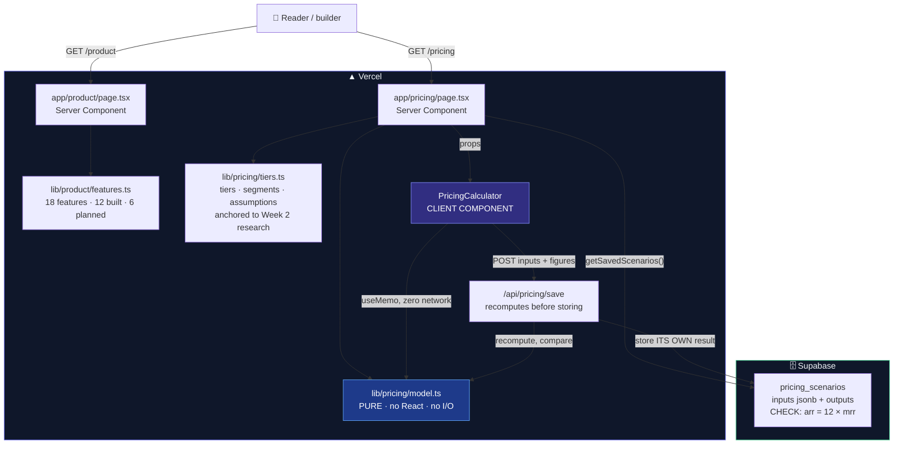
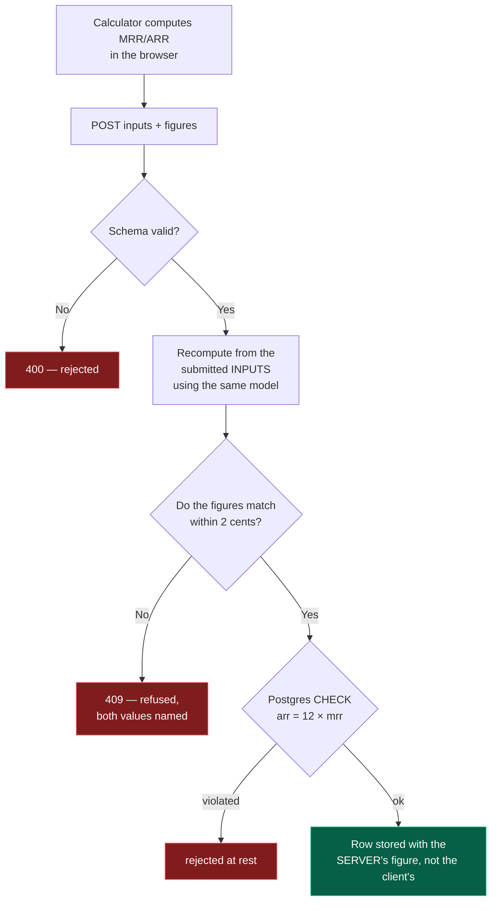

# 🏗 Week 3 Architecture — Product & Pricing

> Mermaid renders natively on GitHub. Screenshot from the GitHub view for the submission PDF.

---

## System components



**`lib/pricing/model.ts` is the centre of this design.** It is imported by the page, the
calculator, the save route, the saved-scenario display, and the test suite — five consumers, one
implementation. The required pricing-logic tests therefore execute the same code the UI runs
rather than a copy, which is the lesson Week 2 taught the hard way.

---

## Why the save route distrusts its own client



The client's arithmetic is **checked, not trusted**. Verified in production: an ARR inflated to
$12 million was refused with 409 and both figures reported.

And because the table stores the **inputs** alongside the outputs, every saved row is
recomputable. `SavedScenarios` does exactly that on render and reports any mismatch — so a change
to the pricing maths becomes visible rather than silent.

---

## Data model — `pricing_scenarios`

| Column | Type | Notes |
|---|---|---|
| `id` | uuid PK | |
| `name` | text | |
| `scenario` | text | CHECK: conservative, base, optimistic |
| `inputs` | **jsonb** | The complete input set — makes the row reproducible |
| `mrr` · `arr` | numeric(12,2) | Both ≥ 0. Written from the **server's** recomputation |
| `created_at` | timestamptz | |

```sql
constraint arr_is_twelve_times_mrr
  check (abs(arr - (mrr * 12)) < 0.02)
```

ARR is a **run-rate**, not the sum of a growing projection. Conflating the two overstates revenue
by roughly 60% at 8% monthly growth, so the relationship is enforced in the database rather than
trusted to the application.

---

## Tech stack — Week 3 additions

| Layer | Choice | Why, and what was rejected |
|---|---|---|
| Pricing maths | **Pure TypeScript, zero dependencies** | Testable without a DOM. *Rejected: calculating inside the component* — untestable except through the UI, which is what went wrong in Week 2 |
| Calculator | **Client Component + `useMemo`** | Instant recompute. *Rejected: a server action per keystroke* |
| Projection chart | **CSS flex bars** | *Rejected: Recharts* — a dependency to draw twelve rectangles |
| Price anchoring | **Week 2 verified competitor figures** | *Rejected: plausible-looking prices* — the exact failure this module invites |
| FX rate | **Fetched once, dated, stated** | *Rejected: a live FX API* — a key and a dependency for a number nobody re-checks |
| Persistence | **Supabase, inputs + outputs** | Makes every saved row a regression test |

**Net new third-party dependencies: zero**, for the fourth week running.
